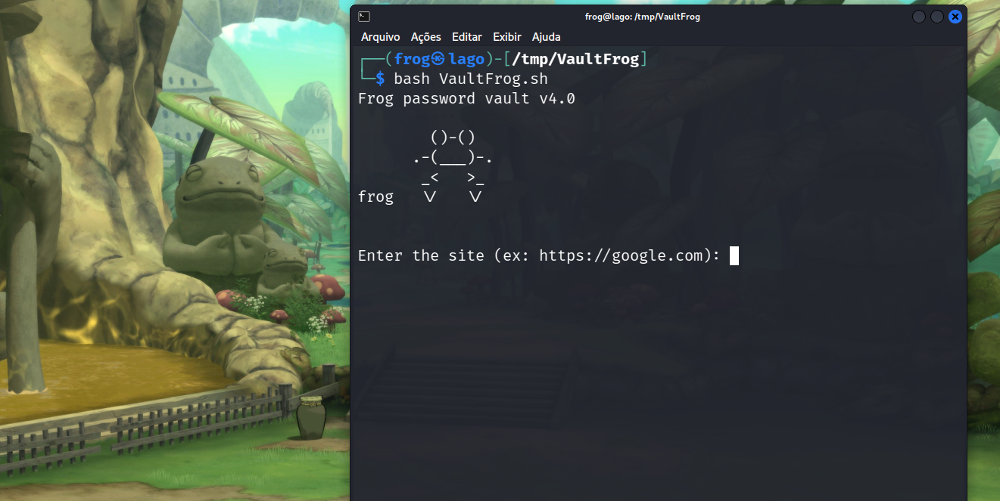
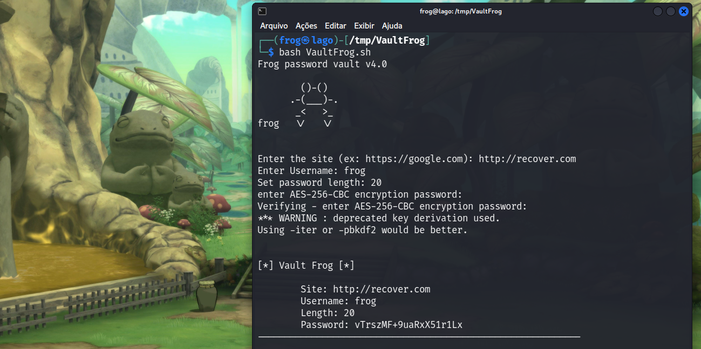
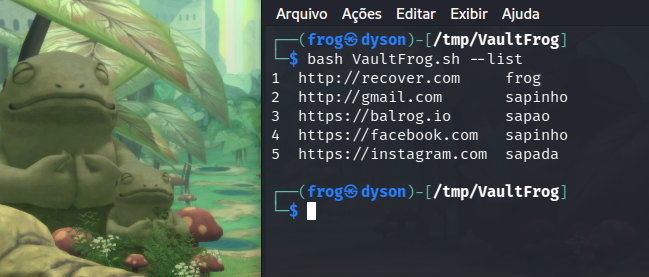
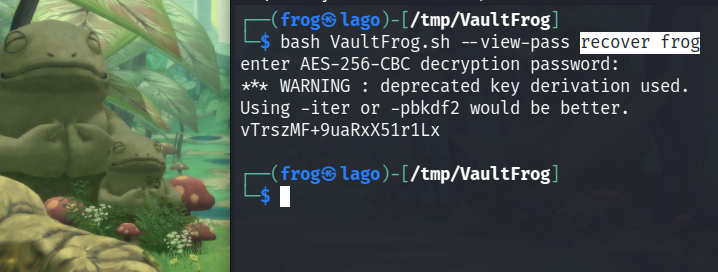

# Vault Frog v4.0 :frog:  
> A simple password vault based in bash using AES-256-CBC.  
#  
[](Banner)  
#  
### Requirements:  
 * Openssl
 * Sqlite3
#### Install openssl:  
```
frog@lago:~$ sudo apt update
frog@lago:~$ sudo apt install openssl -y
```
#### Install sqlite3:  
```
frog@lago:~$ sudo apt update
frog@lago:~$ sudo apt install sqlite3 -y
```
### Usage:  
#### Help:  
```
frog@lago:~$ bash VaultFrog.sh --help
```
[](Help)  
#### Store credential:  
```
frog@lago:~$ bash VaultFrog.sh 
```
[](Store)  
#### List creds:  
```
frog@lago:~$  bash VaultFrog.sh --list
```
[](Store)  
#### Recover:  
```
frog@lago:~$ bash VaultFrog.sh --view-pass SITE_NAME USER_NAME
```
[](Recover)  

:frog:
